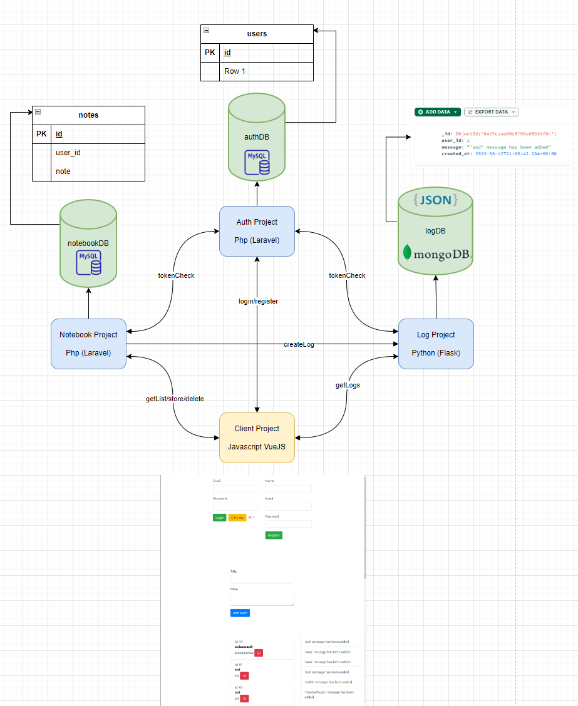

# python-mongodb-microservice

I had developed a microservice application in the related
 repository: https://github.com/selahattingns/laravel-vuejs-microservice. 
 It includes authentication and notebook services. Token security is 
 handled with Auth, and data is stored with the notebook service. 
 Requests are made from the notebook service to the Auth service to 
 ensure token validation. In this context, I have also implemented a 
 log service. When data is entered into the notebook service, a request 
 is made to this service. While data is stored in MySQL for Auth and notebook 
 services, the data here is stored using MongoDB. In the relevant 
 laravel-vuejs-microservice repository, I had written a client project 
 using Vue.js. Everything is combined there. After logging in, if a note is 
 added, the log listing API runs after the response, executing this service. 
 This forms a complete microservice project as a whole

install commands;

    pip install flask
    pip install mongoengine
    pip install Flask-CORS
    pip3 install requests

run command;
    
    python run.py
    
Structure;

Note: python version: 3.8
